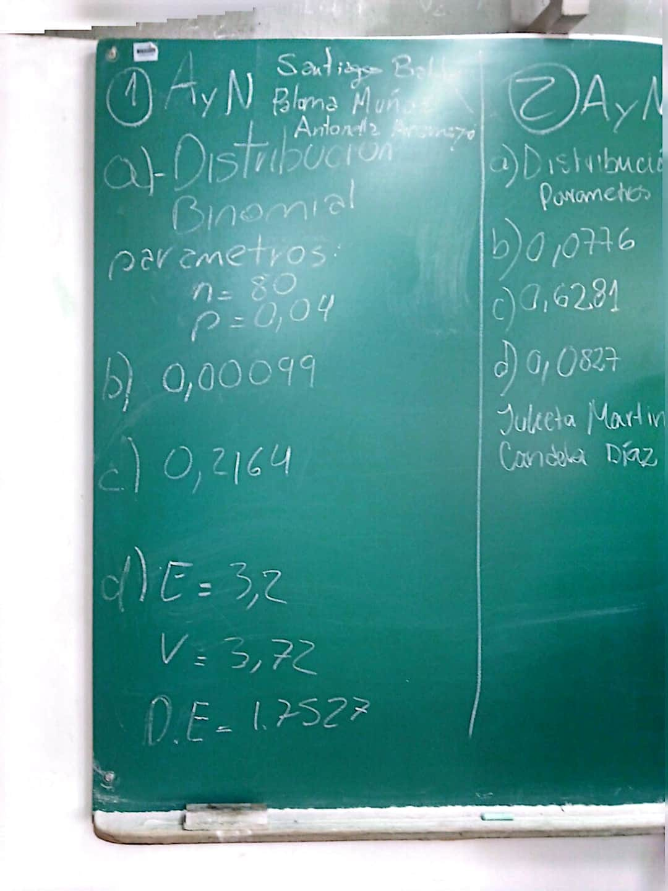
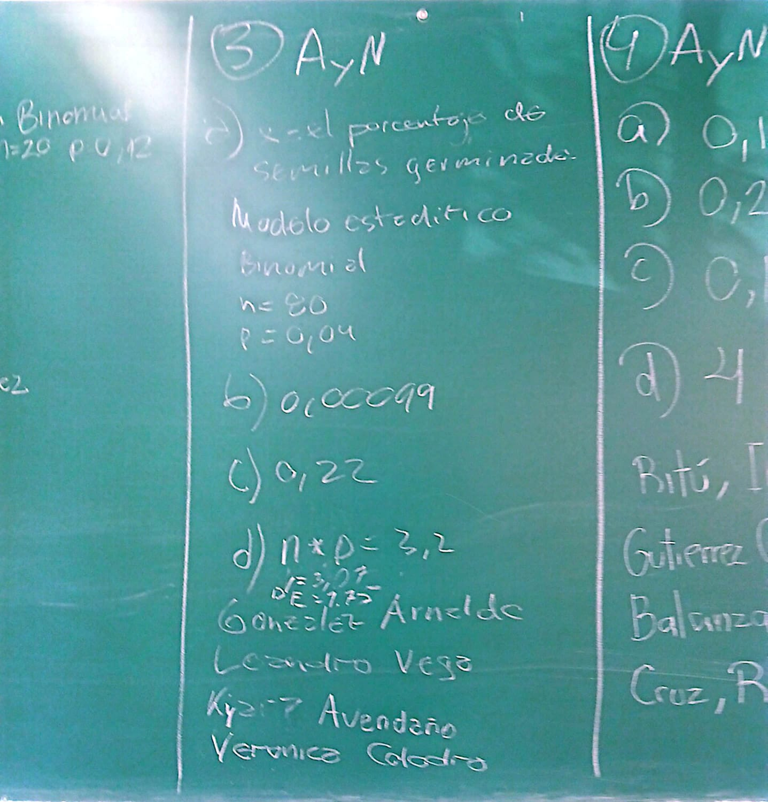
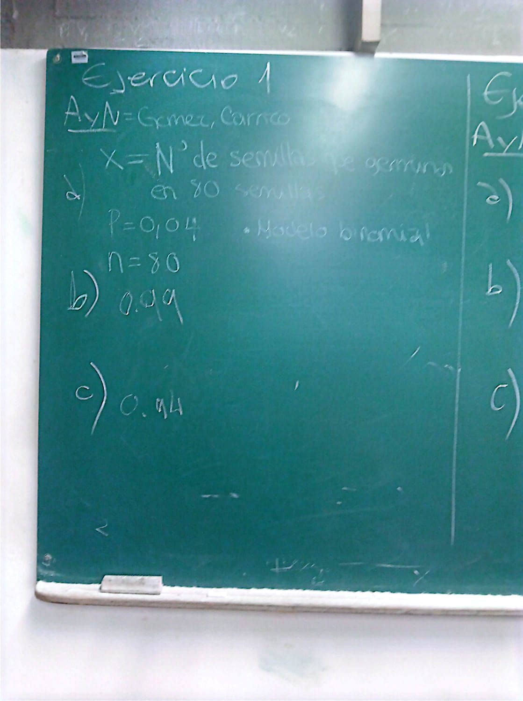
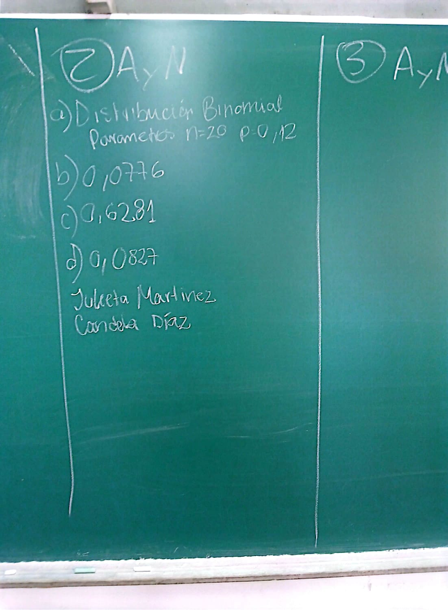
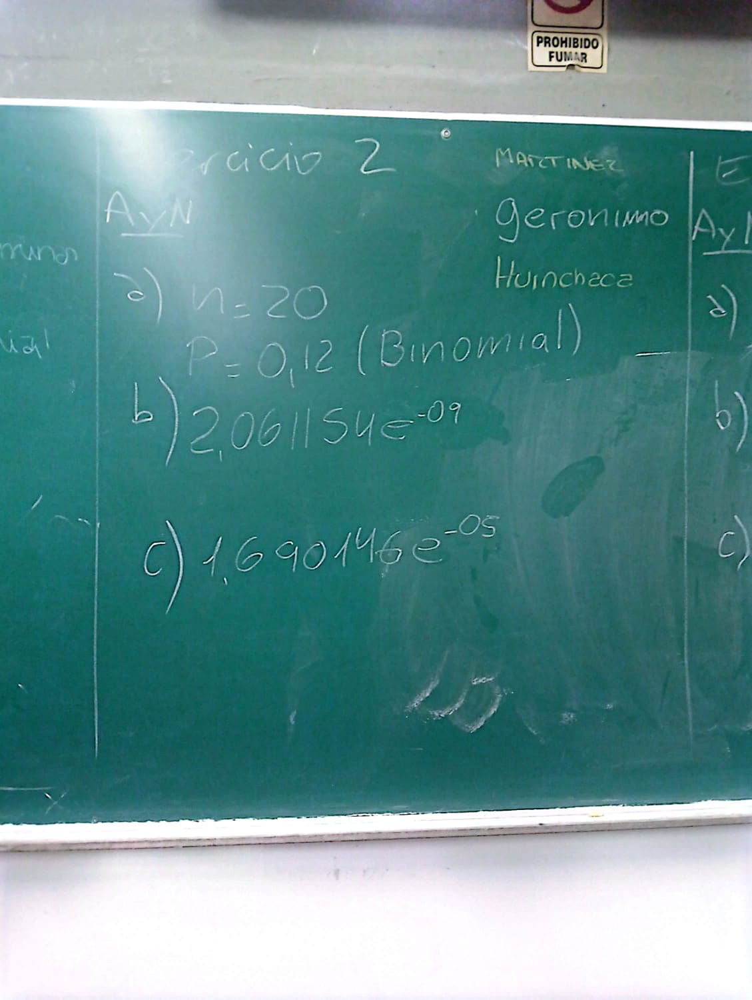
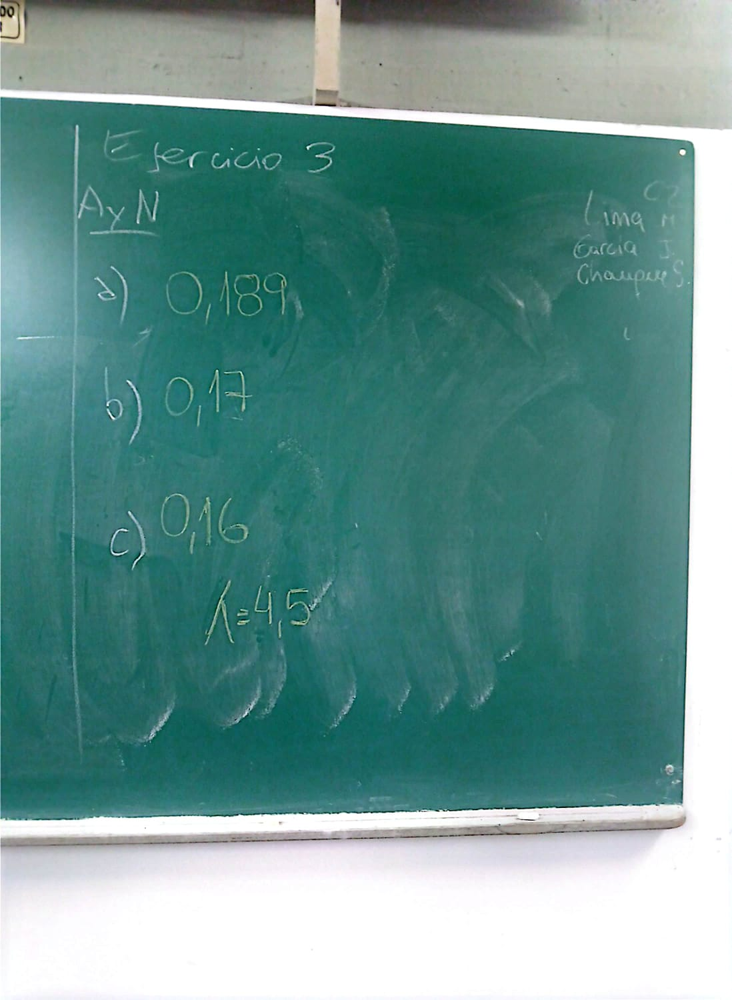
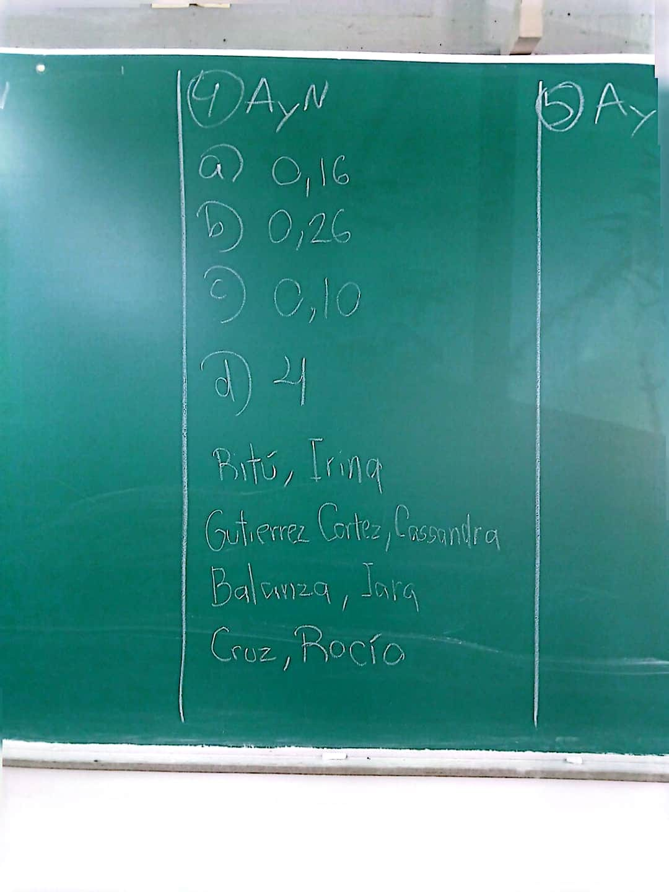

<div style="
  background-color: #e3f2fd; 
  border-radius: 15px; 
  padding: 20px 25px; 
  margin: 20px 0;
  border-left: 5px solid #1e88e5;
  box-shadow: 0 2px 4px rgba(0,0,0,0.1);
  font-family: 'Segoe UI', Arial, sans-serif;
  color: #0d3c5e;
  line-height: 1.6;
">
  <p style="margin: 0; font-size: 1.05rem;">
    <strong>Objetivos del Trabajo Práctico</strong><br><br>
    El trabajo práctico tiene como objetivos: 
    <strong>(1)</strong> Reconocer situaciones donde los supuestos de los modelos Binomial y Poisson resultan razonables (ensayos independientes con probabilidad constante, o conteo de ocurrencias en un intervalo continuo de espacio o tiempo); 
    <strong>(2)</strong> Especificar correctamente los parámetros de cada distribución a partir del contexto biológico o ambiental (n y p para el modelo Binomial; λ para el modelo de Poisson); 
    <strong>(3)</strong> Calcular e interpretar probabilidades puntuales y acumuladas [P(X = k), P(X ≤ k), P(X > k)] utilizando las funciones de R correspondientes; 
    <strong>(4)</strong> Calcular e interpretar la esperanza, la varianza y el desvío estándar de variables con distribución Binomial y de Poisson; 
    <strong>(5)</strong> Verificar las condiciones de aplicabilidad de la aproximación de la distribución Binomial por la de Poisson, y aplicarla en el estudio de eventos de baja probabilidad; y 
    <strong>(6)</strong> Interpretar los resultados obtenidos en el marco de la práctica profesional en Ciencias Biológicas.
  </p>
</div>

::: callout-important
## Lectura Sugerida para el Trabajo Práctico

Se recomienda a los estudiantes consultar el libro **«Apuntes de
Bioestadística. Con ejercicios resueltos»** para profundizar los
conceptos teóricos y metodológicos desarrollados en este marco:

- **Unidad 5: Distribución Binomial**: Consultar las condiciones de
  aplicabilidad del modelo (ensayos tipo Bernoulli, independencia,
  probabilidad de éxito constante), su definición formal y el cálculo
  de probabilidades puntuales y acumuladas.
- **Unidad 5: Distribución de Poisson**: Revisar las condiciones del
  modelo (independencia de ocurrencias, tasa media constante λ,
  sucesos "raros"), su definición formal y sus propiedades
  (esperanza y varianza iguales a λ).
- **Unidad 5: Aproximación de la Binomial por la Poisson**: Prestar
  atención a las condiciones bajo las cuales dicha aproximación es
  válida, y a su utilidad práctica para el estudio de eventos de
  baja probabilidad en muestras grandes.

Como lecturas complementarias, se sugiere también revisar la unidad
*«Modelos probabilísticos»* del libro **«Estadística y Biometría»**
de Balzarini et al., y la unidad *«Statistical Models»* del libro
**«Data Analysis for the Life Sciences»** de Irizarry et al.
:::

## Generalidades

En la Unidad anterior se estableció que toda variable aleatoria
discreta queda caracterizada por una función de probabilidad de masa
y su correspondiente función de distribución acumulada. Ahora bien,
en la práctica no siempre es necesario construir esa función "desde
cero": existen modelos teóricos que, bajo determinados supuestos,
permiten asignar probabilidades a una variable discreta a partir de
unos pocos parámetros. En este Trabajo Práctico se trabaja con dos de
los modelos discretos más utilizados en Ciencias Biológicas: el
modelo **Binomial** y el modelo de **Poisson**.

### El modelo Binomial: conteo de éxitos en ensayos independientes

El modelo Binomial se aplica cuando un experimento consiste en repetir
un número fijo *n* de ensayos independientes entre sí, cada uno con
solo dos resultados posibles (éxito/fracaso) y con una probabilidad de
éxito *p* que se mantiene constante en cada ensayo. La variable de
interés es el número total de éxitos obtenidos, que puede tomar
cualquier valor entero entre 0 y *n*. Este esquema aparece, por
ejemplo, al registrar cuántos individuos de una muestra presentan una
determinada condición (una infección, un fenotipo, la presencia de
una especie en un cuadrante), siempre que los individuos puedan
considerarse independientes entre sí y la probabilidad de la
condición sea razonablemente constante en la población muestreada.

### El modelo de Poisson: conteo de eventos en un continuo

El modelo de Poisson, en cambio, no parte de un número fijo de
ensayos, sino de un intervalo continuo, por ejemplo de espacio o de tiempo, y
modela el número de veces que ocurre un evento dentro de ese
intervalo. Se aplica cuando los eventos ocurren de forma independiente
unos de otros, a una tasa media constante λ, y cuando la probabilidad
de que ocurra más de un evento en un intervalo infinitamente pequeño
es prácticamente nula. Es el modelo natural para conteos como el
número de individuos avistados por transecto, el número de larvas por
cuadrante de muestreo, o el número de lesiones por unidad de longitud
de una secuencia génica.

### De la Binomial a la Poisson: una aproximación útil

Cuando en un esquema Binomial el número de ensayos *n* es muy grande y
la probabilidad de éxito *p* es muy pequeña —de modo que su producto
λ = n·p se mantiene moderado—, la distribución de Poisson con
parámetro λ constituye una buena aproximación de la distribución
Binomial. Esta propiedad resulta especialmente útil en Biología para
estudiar sucesos de baja probabilidad en muestras grandes, como la
aparición de una mutación rara en una población o el registro de una
especie poco frecuente en un muestreo extenso, evitando el cálculo
directo de factoriales con valores de *n* muy grandes.

```{mermaid}
%%| fig-cap: "Marco conceptual de la Unidad de Distribuciones Discretas"
flowchart LR
    A[Variable Aleatoria Discreta] --> B{"¿Qué tipo de proceso genera los datos?"}
    B -->|"n ensayos independientes<br/>con p constante"| C["Modelo Binomial<br/>Bi(n, p)"]
    B -->|"Conteo de eventos en un<br/>continuo de espacio/tiempo"| D["Modelo de Poisson<br/>P(λ)"]
    C -->|"n grande, p pequeño,<br/>λ = n·p < 10"| D
    C --> E["E(X) = n·p<br/>Var(X) = n·p·(1-p)"]
    D --> F["E(Y) = λ<br/>Var(Y) = λ"]
    
```


## **Actividad de pre-clase**

Deberá copiar y pegar el siguiente *prompt* dentro del chat del cuaderno de *Notebooklm* creado luego de la clase anterior. Luego deberá copiar y pegar el ejercicio generado por la IA en un archivo .txt o bien en un documento de word o similar. 
`Se le solicitará la presentación del ejercicio durante la clase`.

```{html}

Actúa como un docente de Bioestadística de la Licenciatura en Ciencias Biológicas. 
Genera 1 único ejercicio basado en un caso de aplicación de estudio biológico que pueda ser resuelto utilizando las distribuciones Binomial y Poisson.
El ejercicio debe incluir incisos específicos para:
- Identificar la variable aleatoria y fundamentar los supuestos de ambos modelos.
- Definir los parámetros de cada distribución (n, p, lambda).
- Calcular la esperanza, varianza y desvío estándar para ambos modelos.
- Calcular probabilidades puntuales y acumuladas.
- Evaluar las condiciones de aplicabilidad de la aproximación de la Binomial por Poisson.
- Proporciona únicamente la consigna completa redactada de forma clara y directa. No generes la solución.


```


## **Actividad de clase**

**Notas de clase**

- **Santiago, Paloma, Antonella** (Ejercicio 1)
  - a) Identificación correcta: Modelo Binomial con `n = 80`, `p = 0,04`. `Nota: `faltó definir la variable aleatoria.
  - b) `P(X = 10) = 0,00099` (correcto).
  - c) `P(X ≥ 5) = 0,2164` (correcto, precisión decimal adecuada).
  - d) `E(X) = 3,2`; `Var(X) = 3,072`; `DE(X) = 1,7527` (correctos en su totalidad).
  
```{r, echo=FALSE, message=FALSE, warning=FALSE, out.width="40%"}


```
  

- **Arnaldo, Leandro, Kyara Avendaño, Veronica** (Ejercicio 3)
  - a) Identificación correcta: Modelo Binomial con `n = 80`, `p = 0,04`.
  - b) `P(X = 10) = 0,00099` (correcto).
  - c) `P(X ≥ 5) = 0,22` (correcto por redondeo).
  - d) `E(X) = 3,2` y `DE(X) = 1,75` (correctos). 
  **Nota: Ustedes tenían que resolver el 3!** 
  
    
```{r, echo=FALSE, message=FALSE, warning=FALSE, out.width="40%"}


```

- **Candela Carrizo, Benjamín Gómez** (Ejercicio 1)
  - a) Modelo Binomial correcto: `n = 80`, `p = 0,04`. Variable aleatoria bien definida.
  - b) `P(X = 10) != 0,99` (revisar decimales).
  - c) `P(X ≥ 5) != 0,94` (revisar los cálculos)
  
```{r eval=FALSE}

n=80; p=0.04
1 - pbinom(4, n, p) # ¿por qué 4?

```

  
d) No se pidió por falta de tiempo.

    
```{r, echo=FALSE, message=FALSE, warning=FALSE, out.width="40%"}


```

- **Julieta Martínez, Candela Díaz** (Ejercicio 2)

  - a) Modelo Binomial correcto: `n = 20`, `p = 0,12`.
  - b) `P(X = 0) = 0,0776` (correcto).
  - c) `0,6281` (correcto).
  - d) `0,0827` (correcto).

```{r, echo=FALSE, message=FALSE, warning=FALSE, out.width="40%"}


```

- **Marcelo, Gianella, Tania** (Ejercicio 2)
  - a) Modelo Binomial correcto: `n = 20`, `p = 0,12`.
  - b) `P(X = 0) = 0,0776` (faltó).
  - c) `2,0611e-09` (incorrecto: revisar el cálculo)

```{r eval=FALSE}

n=20; p=0.12
sum(dbinom(2:4,n,p))
# o bien
pbinom(4,n,p)-pbinom(1,n,p) # ¿por qué 1?

```
  - d) `1,69e-05` (incorrecto). Revisar el cálculo: `1 - pbinom(4, 20, 0.12)`.
  
```{r, echo=FALSE, message=FALSE, warning=FALSE, out.width="40%"}


```

- **Mariela Lima, Jimena Garcia, Serena Chauque** (Ejercicio 3)

  - a) `P(Y = 4) = 0,189` (correcto; valor exacto 0,1898).
  - b) `P(Y ≤ 2) = 0,17` (correcto; valor exacto 0,1736).
  - c) `P(Y > 6) = 0,16` (incorrecto, revisen los cálculos):

```{r eval=FALSE}

lambda = 4.5
1 - ppois(5, lambda) # ¿por qué 5?

```


d) No se pidió por falta de tiempo.
  
```{r, echo=FALSE, message=FALSE, warning=FALSE, out.width="40%"}


```

- **Irina Ritú, Cassandra Gutierrez Cortez, Iara Balanza, Rocío Cruz** (Ejercicio 4)

  - a) `P(Y = 0) = 0,16` (correcto, a 4 decimales es 0,1653, por lo tanto 0,17 a dos decimales).
  - b) `P(Y = 2) = 0,26` (correcto, pero el redondeo a dos decimales es 0,27, y a 4 decimales es 0,2678).
  - c) `P(Y > 3) = 0,10` (revisar los cálculos):
  

```{r eval=FALSE}

lambda = 1.8
1 - ppois(2, lambda) # ¿por qué 2 y no 3?

```

  - d) `4` (Correcto)

```{r, echo=FALSE, message=FALSE, warning=FALSE, out.width="40%"}


```

## Micro-ejercicios de aplicación (optativos)

Los siguientes micro-ejercicios te permitirán practicar los conceptos revisados en esta unidad.
Puedes copiar y pegar las preguntas en un script de R local, o bien utilizar `webR`, que es la versión *online* de R, disponible en esta guía.

`Nota`: los ejercicios están inspirados en trabajos científicos publicados, pero contienen datos simulados.
Por lo tanto, los resultados obtenidos deben interpretarse únicamente con fines didácticos y no como evidencia científica.

La finalidad es familiarizarse con el análisis estadístico y con el uso de R a partir de situaciones similares a las que pueden encontrarse en investigaciones reales.


```{r eval = FALSE, collapse=TRUE}

#  Instrucciones generales
#  -----------------------
#  En cada ejercicio:
#    (a) identifique la variable aleatoria, el modelo probabilístico y sus parámetros
#    (b) plantee la función de probabilidad y/o acumulada en notación estadística
#    (c) seleccione e implemente la función de R correspondiente (dbinom, pbinom, qbinom, dpois, ppois, qpois)
#    (d) interprete la probabilidad calculada, el cuantil o los parámetros en el contexto biológico
#    (e) elabore una conclusión o síntesis en el contexto del problema ecológico / biológico
#
# =============================================================================

#  Funciones disponibles (R base):
#
#    dbinom(x, size, prob)   # Función de probabilidad de masa Binomial P(X = x)
#    pbinom(q, size, prob)   # Función de distribución acumulada Binomial P(X <= q)
#    qbinom(p, size, prob)   # Cuantil de la distribución Binomial
#    rbinom(n, size, prob)   # Generación de valores aleatorios Binomial
#
#    dpois(x, lambda)        # Función de probabilidad de masa Poisson P(X = x)
#    ppois(q, lambda)        # Función de distribución acumulada Poisson P(X <= q)
#    qpois(p, lambda)        # Cuantil de la distribución Poisson
#    rpois(n, lambda)        # Generación de valores aleatorios Poisson
#
#    plot(x, y, ...)         # Gráfico de puntos para distribuciones discretas
#    barplot(height, ...)    # Gráfico de barras para distribuciones discretas
#    data.frame(...)         # Tabla de datos para comparar modelos
#
#  Estadísticos "manuales" (esperanza y varianza):
#    Esperanza Binomial:  E_X = n * p
#    Varianza Binomial:   Var_X = n * p * (1 - p)
#    Esperanza Poisson:   E_X = lambda
#    Varianza Poisson:    Var_X = lambda
#
# =============================================================================


# ─────────────────────────────────────────────────────────────────────────────
#  SECCIÓN 1 — DISTRIBUCIÓN BINOMIAL
# ─────────────────────────────────────────────────────────────────────────────

# Ejercicio B1
# ------------
# En un programa de conservación y restauración de bosques altoandinos en la
# Puna jujeña (Cavi, departamento Susques), se evalúa la capacidad germinativa
# de semillas de Queñoa (Polylepis tomentella). En ensayos de laboratorio bajo
# condiciones de temperatura y humedad reguladas, la probabilidad de que una
# semilla viable germine con éxito a los 21 días es p = 0.25. Un biólogo coloca
# n = 16 semillas en una bandeja experimental con sustrato estéril.
#
# a) ¿Cuál es la probabilidad de que germinen exactamente 4 semillas?
# b) ¿Cuál es la probabilidad de que germinen a lo sumo 3 semillas?
# c) ¿Cuál es la probabilidad de que germinen más de 6 semillas?
# d) Calcule la esperanza matemática E(X), la varianza Var(X) y el desvío
#    estándar σ(X) del número de semillas germinadas.
# e) Mediante la función qbinom(), determine el número mínimo de semillas
#    germinadas tal que la probabilidad acumulada sea de al menos 90%.

# Su código aquí:


# Ejercicio B2
# ------------
# En investigaciones de ecofisiología vegetal en la provincia fitogeográfica
# del Monte en Mendoza, se analiza la tolerancia al estrés hídrico de plantines
# de Jarilla (Larrea divaricata). Se sabe por antecedentes experimentales que
# el 18% (p = 0.18) de los plantines muestra síntomas de marchitamiento
# permanente tras 20 días de privación severa de riego. Un equipo de campo
# selecciona una muestra aleatoria independiente de n = 20 plantines.
#
# a) ¿Cuál es la probabilidad de que ningún plantín sufra marchitamiento?
# b) ¿Cuál es la probabilidad de que entre 2 y 5 plantines (inclusive)
#    manifiesten marchitamiento permanente?
# c) ¿Cuál es la probabilidad de que al menos 4 plantines se marchiten?
# d) Grafique la función de probabilidad de masa completa P(X = x) para
#    x = 0, 1, ..., 20 utilizando la función barplot() o plot(), agregando
#    títulos y etiquetas claras en los ejes.

# Su código aquí:


# Ejercicio B3
# ------------
# Durante campañas de monitoreo parasitológico e higiene biológica en la
# Reserva de Biósfera Laguna de los Pozuelos, investigadores de la UNJu
# evalúan la presencia de hemoparásitos en vicuñas (Vicugna vicugna) capturadas
# temporalmente para esquila ecosustentable. Históricamente, el 12% de los
# individuos adultos presenta infección por protozoos sanguíneos. En una
# jornada de muestreo se analiza la sangre de n = 15 vicuñas.
#
# a) ¿Cuál es la probabilidad de que exactamente 2 vicuñas presenten
#    hemoparásitos?
# b) ¿Cuál es la probabilidad de que a lo sumo 1 vicuña esté infectada?
# c) ¿Cuál es la probabilidad de encontrar 3 o más vicuñas infectadas en
#    el grupo?
# d) Si el protocolo sanitario establece alerta epidemiológica cuando más de
#    4 individuos resultan positivos, ¿cuál es la probabilidad de activar dicha
#    alerta en esta muestra?
# e) Calcule E(X) y σ(X) e interprete biológicamente el resultado.

# Su código aquí:


# Ejercicio B4
# ------------
# Un estudio entomológico en la Quebrada de Humahuaca examina el grado de
# agallamiento foliar causado por dípteros cecidógenos en Aguaribay (Schinus
# molle). La probabilidad de que un folíolo tomado al azar presente al menos una
# agalla bien desarrollada es p = 0.30. Un investigador examina n = 12
# folíolos de un fuste principal.
#
# a) ¿Cuál es la probabilidad de encontrar exactamente 3 folíolos agallados?
# b) ¿Cuál es la probabilidad de que menos de 3 folíolos presenten agallas?
# c) ¿Cuál es la probabilidad de que al menos la mitad de los folíolos
#    (6 o más) estén afectados?
# d) Obtenga el cuantil del 95% de la distribución con qbinom() e interprete
#    qué representa este valor en el contexto del daño foliar.

# Su código aquí:


# Ejercicio B5
# ------------
# En estudios demográficos de aves rapaces neotropicales, se realiza el sexado molecular de
# pichones de Cóndor Andino (Vultur gryphus). Suponiendo una proporción de
# sexos 1:1 en el momento de la eclosión (p = 0.50 para hembras), se analizan
# n = 10 pichones nacidos en la presente temporada reproductiva.
#
# a) ¿Cuál es la probabilidad de que exactamente 5 pichones sean hembras?
# b) ¿Cuál es la probabilidad de que el número de hembras se encuentre entre
#    4 y 6 (inclusive)?
# c) ¿Cuál es la probabilidad de observar un sesgo severo con más de 7 hembras?
# d) Calcule la esperanza matemática y la varianza de la variable aleatoria X
#    (número de pichones hembra en la nidada).

# Su código aquí:


# Ejercicio B6
# ------------
# En poblaciones naturales de anfibios de las Yungas jujeñas, la frecuencia
# de un alelo recesivo que produce una coloración melánica atípica en el Sapo
# de Yunga (Rhinella rumbolli) genera una prevalencia del fenotipo del 8%
# (p = 0.08) en estados larvarios. Se recolecta una muestra al azar de
# n = 25 renacuajos en un cuerpo de agua semipermanente.
#
# a) ¿Cuál es la probabilidad de que ninguno de los renacuajos muestre el
#    fenotipo melánico?
# b) ¿Cuál es la probabilidad de que exactamente 2 renacuajos sean melánicos?
# c) ¿Cuál es la probabilidad de hallar al menos 3 renacuajos melánicos?
# d) Determine la mediana de la distribución utilizando qbinom(0.5, ...).
# e) Calcule el valor esperado E(X) y el desvío estándar σ(X) de renacuajos
#    melánicos en muestras de este tamaño.

# Su código aquí:


# ─────────────────────────────────────────────────────────────────────────────
#  SECCIÓN 2 — DISTRIBUCIÓN DE POISSON
# ─────────────────────────────────────────────────────────────────────────────

# Ejercicio P1
# ------------
# En evaluaciones de la calidad ecológica de cursos de agua de montaña en el
# Río Grande (sector Tilcara), se utiliza el recuento de ninfas de insectos
# acuáticos del orden Ephemeroptera como bioindicador de aguas oligotróficas.
# Los muestreos históricos con red de Surber (superficie estándar de 0.1 m²)
# indican un promedio de λ = 4.2 ninfas por unidad de muestra.
#
# a) ¿Cuál es la probabilidad de que en una muestra de 0.1 m² no se registre
#    ninguna ninfa de Ephemeroptera?
# b) ¿Cuál es la probabilidad de encontrar exactamente 4 ninfas en la muestra?
# c) ¿Cuál es la probabilidad de encontrar más de 6 ninfas en esa misma área?
# d) Si el área de muestreo se duplica a 0.2 m² (parámetro λ_nuevo = 8.4),
#    ¿cuál es la probabilidad de encontrar al menos 5 ninfas de Ephemeroptera?

# Su código aquí:


# Ejercicio P2
# ------------
# Durante monitoreos de biodiversidad nocturna de mamíferos voladores en la
# selva pedemontana del Parque Nacional Calilegua, se utilizan redes de niebla
# para capturar murciélagos frugívoros (Sturnira lilium). En un intervalo de
# muestreo estándar de 4 horas, se registra un promedio de λ = 2.5 capturas por
# red desplegada.
#
# a) ¿Cuál es la probabilidad de que en una red no se capture ningún individuo
#    durante el período de muestreo?
# b) ¿Cuál es la probabilidad de capturar entre 2 y 4 murciélagos (inclusive)?
# c) ¿Cuál es la probabilidad de que se capturen más de 5 individuos en una red?
# d) Utilizando la función qpois(), determine el número de capturas X a partir
#    del cual se acumula al menos el 90% de probabilidad.

# Su código aquí:


# Ejercicio P3
# ------------
# En investigaciones liquenológicas sobre fustes de Aliso del Cerro (Alnus
# acuminata) en los bosques montanos de Yala, se cuenta la densidad de talos
# de líquenes crustosos por cuadrícula de madera de 10 cm x 10 cm. El promedio
# observado es de λ = 3.6 talos por cuadrícula.
#
# a) ¿Cuál es la probabilidad de observar una cuadrícula completamente limpia
#    sin ningún talo (X = 0)?
# b) ¿Cuál es la probabilidad de hallar exactamente 3 talos de liquen?
# c) ¿Cuál es la probabilidad de hallar 6 o más talos en una cuadrícula?
# d) Grafique la función de probabilidad de Poisson para λ = 3.6 en el rango
#    x = 0, 1, ..., 12 mediante barplot() o plot(), identificando la moda.

# Su código aquí:


# Ejercicio P4
# ------------
# En el laboratorio de microbiología ambiental de la FCA-UNJu, se efectúa el
# recuento de bacterias solubilizadoras de fósforo (Pseudomonas fluorescens) en
# placas Petri con agar selectivo, a partir de diluciones de suelo forestal de
# Yungas. El recuento promedio por campo microscópico es de λ = 5.0 colonias.
#
# a) ¿Cuál es la probabilidad de observar exactamente 5 colonias en un campo?
# b) ¿Cuál es la probabilidad de observar menos de 3 colonias (X <= 2)?
# c) ¿Cuál es la probabilidad de observar más de 8 colonias en un campo?
# d) ¿Cuál es el valor más probable (moda) de la distribución? Verifique su
#    respuesta calculando dpois(4:6, lambda = 5.0).

# Su código aquí:


# Ejercicio P5
# ------------
# En estudios de conservación de ungulados autóctonos amenazados en los
# pastizales de neblina de las Serranías de Zapla, se realiza el registro de
# huellas de Taruca (Hippocamelus antisensis) sobre transectas de 500 metros.
# La tasa promedio de avistamiento de pisadas frescas es de λ = 1.8 pisadas por
# transecta.
#
# a) ¿Cuál es la probabilidad de recorre una transecta de 500 m y no hallar
#    ninguna pisada de Taruca?
# b) ¿Cuál es la probabilidad de registrar exactamente 2 pisadas?
# c) Si la transecta se extiende a 1000 metros (distancia doble, λ = 3.6),
#    ¿cuál es la probabilidad de registrar más de 4 pisadas?
# d) Verifique cuantitativamente que para la distribución de Poisson la
#    esperanza matemática E(X) es igual a la varianza Var(X).

# Su código aquí:


# Ejercicio P6
# ------------
# En renovales de Cedro Coya (Cedrela lilloi) bajo dosel forestal en las
# Yungas de Jujuy, la ocurrencia de perforaciones foliares producidas por
# coleópteros defoliadores sigue un proceso de Poisson con una media de
# λ = 2.2 perforaciones por hoja compuesta.
#
# a) ¿Cuál es la probabilidad de que una hoja no presente ninguna perforación?
# b) ¿Cuál es la probabilidad de que una hoja compuesta tenga entre 1 y 3
#    perforaciones (inclusive)?
# c) ¿Cuál es la probabilidad de encontrar más de 5 perforaciones en una hoja?
# d) En una rama que contiene 5 hojas compuestas (intervalo acumulado de
#    λ_total = 11.0), ¿cuál es la probabilidad de contar a lo sumo 8
#    perforaciones en total?

# Su código aquí:


# ─────────────────────────────────────────────────────────────────────────────
#  SECCIÓN 3 — APROXIMACIÓN BINOMIAL–POISSON
# ─────────────────────────────────────────────────────────────────────────────
#
#  Condiciones de aplicabilidad:
#    · Tamaño muestral grande (n >= 100, o n >= 50 si p es muy pequeño)
#    · Probabilidad de éxito muy pequeña (p <= 0.05, "eventos raros")
#    · Parámetro de tasa moderado (λ = n * p < 10)
#
#  En cada ejercicio:
#    (i)   verifique el cumplimiento de los supuestos para la aproximación
#    (ii)  calcule la probabilidad mediante la aproximación de Poisson P(λ)
#    (iii) calcule la probabilidad exacta mediante la Binomial Bi(n, p)
#    (iv)  compare ambos resultados y evalúe la calidad de la aproximación


# Ejercicio A1
# ------------
# En investigaciones de genética forestal sobre especies autóctonas del NOA,
# la frecuencia de mutaciones clorofílicas espontáneas (albinismo parcial) en
# la germinación de Lapacho Amarillo (Tabebuia serratifolia) es de p = 0.015.
# Un biólogo examina un lote de n = 200 plántulas recién germinadas.
#
# a) Verifique las condiciones de aplicabilidad de la aproximación de Poisson
#    e indique el parámetro λ = n * p.
# b) Utilizando la aproximación de Poisson P(λ), calcule P(X = 0), P(X <= 2)
#    y P(X >= 4).
# c) Utilizando la distribución Binomial exacta Bi(200, 0.015), calcule los
#    mismos valores de probabilidad.
# d) Compare numéricamente ambos métodos e interprete la exactitud de la
#    aproximación para la toma de decisiones ecológicas.

# Su código aquí:


# Ejercicio A2
# ------------
# En el vivero de la FCA-UNJu, se evalúa la susceptibilidad de alvéolos de
# inoculación de Aliso del Cerro (Alnus acuminata) al ataque de oomicetes
# patógenos del género Phytophthora. La probabilidad de infección individual en
# alvéolos bajo condiciones controladas es de p = 0.02. Se inspecciona una
# bandeja forestal con n = 150 alvéolos.
#
# a) Verifique los requisitos para aproximar por Poisson y calcule λ.
# b) Mediante la aproximación de Poisson, calcule P(X = 0), P(X = 1) y
#    P(X >= 3).
# c) Mediante la distribución Binomial exacta, calcule las mismas
#    probabilidades.
# d) Construya una tabla comparativa en R utilizando la función data.frame()
#    con las columnas: x, Binomial_Exacta, Poisson_Aproximada y Diferencia.

# Su código aquí:


# Ejercicio A3
# ------------
# En estudios de contaminación por microplásticos en la cuenca del Río San
# Francisco (Jujuy), la probabilidad de que una mojarra (Sproattus spp.)
# contenga fibras de microplástico en su estómago en tramos de cabecera es de
# p = 0.025. Se disecan n = 120 ejemplares capturados durante una campaña.
#
# a) Verifique las condiciones de la aproximación e indique λ = n * p.
# b) Con la aproximación de Poisson, calcule P(X <= 2) y P(X >= 5).
# c) Con la distribución Binomial exacta, calcule los mismos valores.
# d) Calcule el error relativo porcentual en la estimación de P(X <= 2)
#    definido como |P_pois - P_binom| / P_binom * 100.

# Su código aquí:


# Ejercicio A4
# ------------
# En controles de calidad de formulaciones bioplaguicidas a base de Bacillus
# thuringiensis para el control de larvas de insectos en cultivos de la
# Quebrada de Humahuaca, la probabilidad de encontrar una espora atípica no
# viable en alícuotas microscópicas es de p = 0.01. Se analizan n = 250
# alícuotas independientes.
#
# a) Indique los parámetros n y p de la Binomial y determine el valor de λ
#    para la aproximación de Poisson.
# b) Usando la Poisson aproximada, calcule la probabilidad de observar
#    exactamente 0, 1, 2 y 3 esporas atípicas.
# c) Usando la Binomial exacta, calcule las mismas probabilidades.
# d) Si el criterio de rechazo del lote biológico requiere encontrar 5 o más
#    esporas atípicas (X >= 5), calcule la probabilidad de rechazo con ambos
#    modelos y determine si la decisión técnica se altera.

# Su código aquí:


# Ejercicio A5
# ------------
# En relictos de bosques de Polylepis pepei en ambientes de alta montaña en la
# Puna de Jujuy, la aparición de malformaciones foliares teratológicas debidas
# a daño por congelamiento extremo tiene una probabilidad de p = 0.03. Se
# inspecciona una muestra de n = 100 plántulas en una ladera expuesta.
#
# a) Verifique si se cumplen los supuestos para la aproximación de Poisson e
#    indique el parámetro λ.
# b) Mediante la distribución de Poisson, calcule P(X <= 1), P(X = 3) y
#    P(X >= 4).
# c) Mediante la distribución Binomial exacta, calcule las mismas
#    probabilidades.
# d) Elabore un gráfico comparativo de barras utilizando barplot() para
#    x = 0, 1, ..., 8 contrastando dpois(0:8, lambda) y dbinom(0:8, 100, 0.03).

# Su código aquí:


# Ejercicio A6
# ------------
# En monitoreos parasitológicos e histopatológicos de la Trucha Marrón (Salmo
# trutta) introducida en arroyos de la cuenca de Yala, la presencia de cuerpos
# de inclusión virales en cortes histológicos de tejido hepático ocurre con
# una probabilidad de p = 0.008. Un equipo examina n = 300 cortes.
#
# a) Verifique los requisitos para aproximar por Poisson y determine λ.
# b) Utilizando la aproximación de Poisson, calcule P(X = 0), P(X = 2) y
#    P(X >= 3).
# c) Utilizando la distribución Binomial exacta, calcule los mismos valores.
# d) Calcule la probabilidad de encontrar entre 1 y 4 cortes afectados
#    (inclusive) según ambos modelos y comente el grado de concordancia.

# Su código aquí:


# =============================================================================
```

