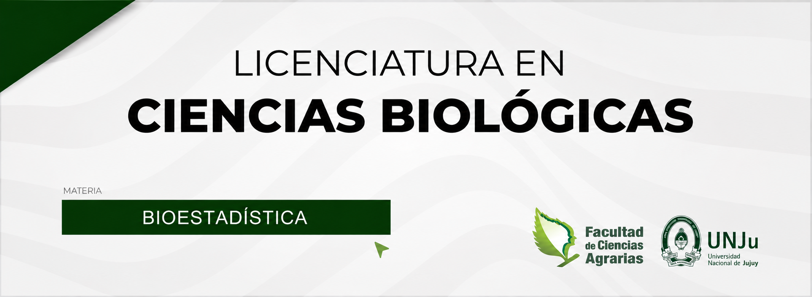

# {.unnumbered}

```{r out.width="100%",fig.align='center', echo=FALSE}

```

::: {style="background-color: AliceBlue; padding: 15px; border-radius: 10px;"}


**Equipo de cátedra**

- Responsable de Cátedra: Prof. Asociado Ing. Agr. Jorge Quiquinto

*Responsables del dictado de Bioestadística 2026*

- Prof. Adjunta Ing. Agr. Marta Leaño

- Jefe de Trabajos Prácticos Mg. Ing. Agr. Juan Manuel Solís

- Ayudante de Segunda: Sr. Daniel Vilca

:::


**Atención: esta guía se irá actualizando paulatinamente.**